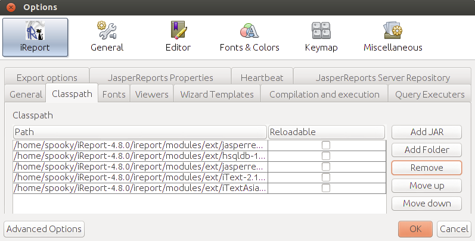
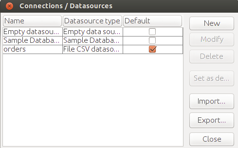

# iReport and Ubuntu Linux - Part I


###Introduction

ireport是個能夠自行定義報表格式的open source，也是目前全球最為流行的報表設計之一，在操作上擁有豐富的圖型設計介面，在國外已有非常完善的介紹，與參考資料，對於中文的部份，尚未有相關書籍進行介紹，在網路上也只有分散於個人部落格的相關文章，在此，將透過一系列的說明，帶領讀者熟悉此好用又強大的報表編輯軟體，從安裝，基礎設置，基本報表設計，到進階的報表使用編輯技巧，將一步步帶領讀者了解整個報表製作與運作過程。


精確的來說，ireport是制作JasperReport的編輯器，而JasperReport又是什麼？他是報表制作程序，使用者需要按照它制定的規則編寫XML文件，建立所要產生的報表。能夠输出的文件格式包括PDF,HTML,XML,XLS,CSV等等。

JasperReport 的運作原理與java很像;java在編寫程式時是以java作為source code 透過compiler 編譯成class檔後執行。

而JasperReport有個對應的jrxml 作為編寫報表儲存程式碼，透過ireport enging編譯為jasper，實際在產生報表時只要有該檔案就可執行，不需要原始的jrxml，在ireport 編輯器上所做的任何修改，都會儲存於jrxml裡，其敘述方式為xml文檔格式，理論上，透過修改jrxml也可以做到動態產生報表格式。

一般來說如果要自己編寫jrxml，若是簡單的報表還好，複雜一點就要人命，沒辦法看到實際報表產出情形，簡直是瞎子摸象，需要耗費非常多的時間除錯！所以ireport就因應而生，協助使用者使用拖拉的方式完成報表，並且可立即檢視報表運作結果，因為ireport的出現，JasperReport才能被普及的運用


說了那麼多就讓我們開始使用ireport，看看他能為我們帶來什麼功能，下面將介紹安裝步驟


### Install

ireport的安裝檔可在 jaspersoft 的官網取得，網址如下：
	
	http://community.jaspersoft.com/project/ireport-designer

因為使用的是os 是 ubuntu 請下載 [iReport-4.8.0.tar.gz](http://sourceforge.net/projects/ireport/files/iReport/iReport-4.8.0/iReport-4.8.0.tar.gz/download)

目前，最新版本為 iReport-4.8.0

請將下載檔案放在 home 目錄，也就是 ~/

或者透過下列指令進行下載


``wget http://downloads.sourceforge.net/project/ireport/iReport/iReport-4.8.0/iReport-4.8.0.tar.gz ~/``

 接著進行解壓縮

``tar zxvf iReport-4.8.0.tar.gz``


在開始執行之前，我們必須先確保java jdk 已有安裝於系統內，可以使用下例指令進行java安裝

``sudo apt-get install openjdk-7-jdk``


幾個簡單步驟後，就可以開始執行ireport啦

``sh ~/iReport-4.8.0/bin/./ireport``


基本安裝完成了！


在開始使用之前，還有些問題需要解決
* ireport 並未內建產生PDF所需的字型
* 除了能夠產生PDF也要能夠正常顯示中文內容的PDF

為了讓irport有產生PDF所需要的字型，我們需要 __iText__

為了讓產生的PDF能夠正常顯示中文內容的PDF 我們需要 __iTextAsian__

iReport 很貼心的，在他的安裝路徑內皆已經內置這兩個jar

接著我們必須告訴ireport這兩個jar 所在位置，將他們加到classpath

請先點選上方 menubar的Tools中的options，如下圖：


點選後會開啟設定畫面，請點選classpath頁籤


接著點選頁面中的 add 按鈕，將目錄移至````~/iReport-4.8.0/ireport/modules/ext````

接著加入 __iText__ 以及 ___itext-asian.jar___ 如下圖


如此以來就完成了！



###注意：classpath 設定完成要記得重啟ireport，設定才會生效


是不是很簡單？基礎設置完成後，我們就可以寫個簡單的報表了

##Quick Start

讓我們利用ireport的報表產生精靈一步步帶大家產生一個基本的報表，透過這樣的過程讓大家了解產生報表所需步驟，廢話不多說，讓我們開始吧！

首先，我們一樣從manu bar 點選 File 中的 New


將會開啟下列畫面


假設我們需要製作一份報表用來查詢___每天出貨完成的的訂單___，讓我一步步帶著大家將第一個報表完成

1. 決定報表樣式
	
	在製作一個報表時，我們必須將我們預期報表需要的樣子設計好，在這裡先選擇Simple Blue

讓我們點選 Launch Report Wizard，進入下一步驟


2. 檔案儲存位置
	
	在此決定檔案的儲存位置，以及檔案名稱，既然我們要做是出貨單，就將Report name命名為shipReport，其中file 就會自動命名為shipReport.jrxml
	
點選下一步，開始設定資料庫來源


 
3. 決定資料來源
	
	報表除了呈現格式外，還有很重要的資料來源，在這個步驟，我們要做的就是設定資料如何取得，在ireport裡可以設定多種資料來源舉凡主流的資料庫 mysql、mssql，到一般的試算表，excel、cvs，甚至是這幾年出現的nosql之資料庫MongoDB都在其支援範圍內，可說是總類繁多，在此就不贅述，讓我們從最簡單的開始，選擇ireprt內建的Simple Database，貼心的讓我們可以方便得測試報表的製作
	選擇資料來源後，當然還要決定我們要用的是哪個table的資料，既然我們要知道已出貨的訂單，就從orders開始，sql如下 
	
		select * from orders
		where SHIPPEDDATE is not null
		order by SHIPPEDDATE
	
	將無已出貨日期的訂單篩選掉，大家還記得我們要製作的是每天出貨完成的訂單喔！還有資料查詢呈現根據 SHIPPEDDATE(已出貨日期)
	
接著我們將設定報表呈現所需要的欄位


4. 選取欄位
	
	上個步驟我們設定好了資料表，接著我們要設定所要呈現的欄位，為了能夠幫助出貨人員清楚知道出貨的資訊，我們當然要選擇最重要的資訊，在畫面中我們可以看到右欄列出了該table的所有欄位，我們可以在這挑選所需的欄位即可，挑選的欄位如畫面所示，必須讓出貨人員清楚知道每天預計交貨的訂單以及客戶，還有貨品需要送達的地址	
	
接者下一步，我們將決定資料的群組方式，為什麼要設群組？？讓我們看下去


5. 群組設定

	群組的用意，簡單來說就是將餵進來的資料進行分類，ireport透過群組設定的方式，偵測設定群組欄位變化來進行自動分群，是不是很方便！一開始有說到我們需要製作一個方便出貨人員知道___每天___出貨完成的訂單有哪些，所以我們將畫面上的 Group 1設為 SHIPPEDDATE(出貨完成時間)，如此一來ireport在產生報表時，就會將資料呈現by出貨日期進行群組並列出每天出貨的訂單有哪些；而在畫面上我們可以看到其實可設定多組群組，道理是一樣的，只要兩種組合有所不同，就會自動換頁。
	
接著下一步就完成我們的每天完成出貨的報表設定囉，是不是很簡單！


讓我們接著看看產生好的報表呈現的樣子，如下圖


透過報表建立精靈，ireport已經根據我們所設定樣式，欄位，還有群組方式產生好報表的內容，我們只要在將畫面上的TITIE進行調整，就是一個可以用的報表啦，讓我們將 ___TITLE___ 改為 ___已出貨完成訂單___

接著我們就可看看成果囉，點選畫面中的preview，ireport就會將剛剛設定好的資料來源一筆筆的輸出到報表裡，並且根據出貨日期做分類，結果就如下圖所示


是不是一個簡單任務阿！

## pdf 輸出中文顯示


在一開始設置ireport時，有提到若要能夠讓pdf輸出中文正常，需要設置__iText__ 以及 ___itext-asian.jar___

除了classpath設置之外，在需要顯示中文的field 也要選擇正確的pdf字型

當您選擇需要顯示中文的欄位時在 __Properties__ 裡，需要調整下列參數

###Pdf font name: MSung-Light

###pdf enccoding: UniCNS-UCS2-H (Chinese traditional)

可參考下圖：


產出的pdf如下圖，可以看到中文字型被正確的輸出。


## 變更資料庫來源:使用CVS

此章節將介紹如何使用CVS 作為資料庫來源

首先，我可以在主畫面看到如下圖圖示


點選之後會開啟 connections / datasources 的設定跳窗如下圖



接著我們可以點選 畫面中的 new，將跳起下圖：


讓我們選擇 __File CSV datasource__，點選 next 將進入CSV 設置畫面，視窗彈出後請先選擇 __Separators__如下圖


我們可以看到__Field separator(char)__ 預設值為 __Comma__ 也就是 ","，這邊我們不需調整

而原本預設的 __Row separator__ 為 New line(Windows)，因為目前運行的環境為ubuntu 請改選為 __New line(Unix)__

接著我們在回到 __Columns__ 頁籤，如下圖所示：


將Name填入，在此我們填入 orders

接著選擇您的 *.cvs 檔案所在位置

根據剛剛的設定的 __Field separator(char)__ 以及 __Row separator__，此時點選 __Get columns name from the first row of the file__ iReport 將自動將CVS 檔案中的第一行資料作為欄位抓取出來，讓我們點選 Save，如此一來就完成 File CSV datasource 的設置啦！

還記得之前 __Quick Start__ 章節的 __決定資料來源__ 步驟，我們只要將資料來源改選為剛剛設置命名為 orders的 File CSV datasource，之後的步驟則完全一樣，依然可以產生同樣的報表結果！


