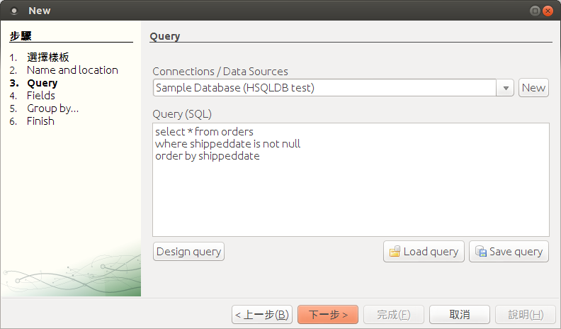

# 使用 iReport 5 免費開源軟體製作精美報表 #

電子報表在辦公室電腦化作業扮演重要的角色，由於需要合併處理數量龐大的資料，需要報表軟體才能省時不費力，例如 Crystal Report 與 Active Report 等都是知名的報表軟體。在全面採用自由軟體的工作環境中，我們使用開放源碼軟體 JasperReport 與 iReport 滿足報表需求。

## Part 1 ##

### 認識 JasperReport 與 iReport ###

JasperReport 是 Jaspersoft 公司的產品，它是一個開放源碼的報表引擎（Report Engine），完全使用 Java 開發，可以產生高品質的報表文件，支援的輸出格式包括 HTML、PDF、CSV、OpenOffice、Word 或 EXCEL 等。

對軟體開發者來說，Jasper Report 是一組 Java 報表函式庫（Reporting Libaries），它用於將定義報表的 XML 原始檔（.jrxml），轉換成已編譯檔（.jasper）；編譯好的報表檔可以搭配其他應用程式如 Java Swing 或 JSP / Servlet 加上外部資料來源以輸出成可視報表。JasperReport 雖然免費但功能一點也不輸給商業軟體，它可以靈活、有彈性的存取多種資料來源，例如資料庫（Database）、CSV 文字檔、XML、JavaBean 等，都可以作為報表的來源資料。

只要搭配 Java EE Container 如 Tomcat 或 Jetty，透過 Web Services 等方式存取，Jasper Report 也能和 Java 以外的開發平台一起運作，讓其他 .NET、PHP 或 Ruby 開發的應用程式，也能享有 JasperReport 強大的報表功能。

iReport Designer 則是專為 JasperReport 開發所視即所得報表設計工具，在操作上擁有友善的視覺化圖形介面，是一個讓初學者相當容易入門好上手的軟體。

JapserReport 與 iReport 在全球有相當高的使用率，只可惜目前缺乏循序漸進的中文說明手冊，讓許多有興趣嘗試的使用者不得其門而入；因此，我們希望動手寫作一系列的教學，從安裝、環境設置、基本設定與操作，幫讀者排除常見的問題，直到進階的報表製作技巧，讓讀者能夠輕鬆駕馭報表工具。

報表處理流程：[iReport] 儲存 -> .jrxml -> [JasperReport] 編譯 -> .jasper 報表輸出 -> HTML, PDF, XLS, …

### 安裝 Java 環境 ###

建議讀者安裝最新的 Java 7 發行版，可以在 Oracle 網站下載取得安裝程式。

http://www.oracle.com/technetwork/java/javase/downloads/index.html

在 Ubuntu Linux 下可以使用 apt-get 指令安裝開源版本的 Open JDK 軟體。

    sudo apt-get install openjdk-7-jdk

安裝完成後先檢查 Java 程式是否能夠被執行，如果能看到正確版本編號則表示安裝順利。

    java -version

### 安裝 iReport 軟體 ###

iReport 的官方網站：
	
http://community.jaspersoft.com/project/ireport-designer

在 SourceForge 可以下載最新版本的 iReport 5.0.1 軟體，Linux 使用者可以下載 iReport-5.0.1.tar.gz 壓縮檔。

http://sourceforge.net/projects/ireport/files/iReport/iReport-5.0.1/

將下載的檔案解壓縮：

	tar zxvf iReport-5.0.1.tar.gz

解壓縮之後，在 bin 資料夾下執行 ireport 程式。

	cd iReport-5.0.1
    ./bin/ireport

執行成功即可看到 iReport 的歡迎畫面。

### 解決中文字型問題 ###

對中文使用者來說，iReport 美中不足之處在於輸出的 PDF 報表無法顯示中文字；我們需要額外的步驟，才能讓 iReport 可以設定且正確顯示中文字型。

我們需要 iText 與 iTextAsian 兩個套件，在新版的 iReport 已內建所需的檔案，位於「ireport/modules/ext」資料夾中。

  * ireport/modules/ext/iText-2.1.7.jar
  * ireport/modules/ext/iTextAsian.jar

iText 是 Java 用於產生 PDF 文件的開源函式庫，iTextAsian 則是特別為亞洲文字（包含中文）提供所需字型的套件。

開啟選單列「工具 / 選項」，切換到「iReport」設定的「Classpath」頁籤。點選「Add JAR」按鈕，並將 iText-2.1.7.jar 與 iTextAsian.jar 兩個檔案加入，然後按下確定儲存本次設定，完成後請先關閉在重新開啟 iReport 程式。

＊請注意：修改 Classpath 設定後需要重新啟動 iReport 才能讓設定生效。

### 使用報表精靈快速上手 ###

iReport 的報表精靈可以方便快速產生新報表，並且內建多個簡潔耐看的報表範本檔，只要幾個步驟就能幫讀者建立第一個報表。

第一個報表，我們希望完成「已出貨訂單」這個範例。讀者只要跟著步驟做，就可以完成最後產生的結果。

使用選單列的「檔案 / New」建立新報表，我們選擇「Simple Blue」這個藍色調的範本格式。

選好範本格式後，點選視窗下方的「Launch Report Wizard」打開報表精靈。

第二個步驟是設定報表名稱（Report name）、儲存位置（Location）與檔名（File）。

設定資料來源（Connections / Data Sources）與查詢（Query），在範例中我們選擇「Sample Database (HSQLDB test)」這個 iReport 提供的測試資料庫。

輸入我們預先設計好的 SQL 查詢語法，這段語法用來查詢資料庫中已出貨的訂單資料（只篩選有出貨日期的資料列）：

	select * from orders
	where shppeddate is not null
	order by shippeddate

查詢結果提供多個欄位（Fields）可供選擇，我們並不需要在出貨報表顯示所有資訊，所以只需要選擇其中幾個欄位。

  * ORDERID（訂單編號）
  * CUSTOMERID（客戶代號）
  * SHIPPEDDATE（出貨日期）
  * SHIPCOUNTY（國家）
  * SHIPCITY（城市）
  * SHIPADDRESS（地址）

群組化（Group By）用來將查詢結果分群，例如我們希望同一天出貨的訂單，被歸類到同一個群組，就在 Group 1 設定「SHIPPEDDATE」，最後在報表呈現時，就會依照出貨日期來安排資料的輸出方式。

到這邊就已經完成報表精靈的設定，沒有下一步囉！

按下完成後，就可以開始編輯報表內容。首先，我們將報表標題「TITLE」改為「已出貨訂單」。

利用報表上方的「Preview」按鈕，可以預覽資料合併輸出後的報表畫面。

### 中文報表 PDF 字型設定 ###

在選單列選擇「Preview / PDF Preview」，切換到預覽畫面時，iReport 會同時建立 PDF 輸出檔（例如 report1.pdf）；但是中文字在 PDF 中會消失，這是因為我們尚未針對中文顯示進行調整。

選取需要顯示中文的欄位，例如我們設定的報表標題，然後在右側「屬性」設定區，調整 PDF 相關的設定如下：

  * Pdf Font name: MSung-Light
  * Pdf Encoding: UniCNS-UCS2-H (Chinese traditional)

利用「Preview」預覽功能輸出 PDF 格式報表文件，可以看到中文字已正確顯示。

