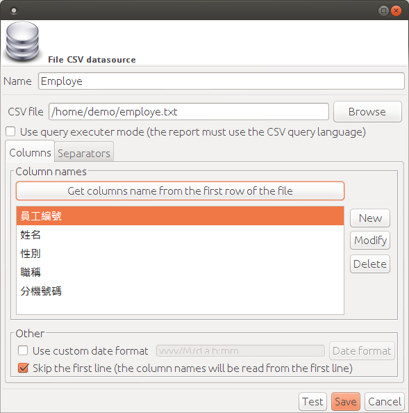

# 使用 iReport 5 免費開源軟體製作精美報表 #

電子報表在辦公室電腦化作業扮演重要的角色，由於需要合併處理數量龐大的資料，需要報表軟體才能省時不費力，例如 Crystal Report 與 Active Report 等都是知名的報表軟體。在全面採用自由軟體的工作環境中，我們使用開放源碼軟體 JasperReport 與 iReport 滿足報表需求。

## Part 2 ##

### 報表資料來源 ###

iReport 支援的資料來源種類非常多，使用上相當有彈性。以下是幾種常見的資料來源類型：

  * Database JDBC connection
  * XML file datasource
  * File CSV datasource
  * Hibernate connection
  * EJBQL connection
  * Microsoft Excel (xls) data source
  * Microsoft Excel 2007 (xlsx) data source
  * Remote XML file datasource
  * JSON datasource
  * MongoDB Connection
  * Hadoop Hive Connection

多數常用的關聯式資料庫，例如 MySQL、PostgreSQL、SQL Server 或 Oracle 都可以找到 JDBC（Java Database Connectivity）驅動程式，在 iReport 中只要選擇「Database JDBC connection」就能以 SQL 建立查詢，將資料庫查詢結果用於報表內容顯示。

### 使用 CSV 文字檔資料來源 ###

CSV 是 Common Separated Values 的縮寫，是一種純文字的檔案格式，以逗號或空白字元作為多個欄位資料之間的分隔。iReport 支援以 CSV 檔案作為報表資料來源，因為 CSV 不需要特定資料庫軟體，只要一般文字編輯軟體（如 gedit 文字編輯器），就可以修改原始資料內容，因此使用上較簡易、應用範圍也廣泛，本次將介紹如何以 CSV 作為報表資料來源。

首先建立一個 UTF-8 編碼格式的純文字檔案「employe.txt」，並參考以下員工資料範例。內容第一行為欄位標題名稱，各標題名稱之間以逗號分隔，以下各行為員工的個人資料，其順序跟欄位名稱一致，同樣以逗號分隔。

    員工編號,姓名,性別,職稱,分機號碼
    A01,陳小莉,女,經理,5301
    A02,王大明,男,專案經理,5302
    A03,張大仟,男,工程師,5303
    A04,李曉龍,女,工程師,5304
    A05,吳明世,男,行政助理,5305

有許多辦公室軟體的試算表工具，例如 LibreOffice Calc 等，可以支援 CSV 檔案的編輯功能。使用這類工具開啟 CSV 檔案時，請注意編碼格式需要選擇「UTF-8」、分隔選項必須設定成「逗號」，才不會造成檔案資料讀取的問題。

### 設定 CSV 報表資料來源 ###

在 iReport 報表編輯畫面上方的主選單，點選「Report Datasource」圖示按鈕。

在「Connections / Datasources」視窗點選右方的「New」按鈕。

在資料來源的選項中，選取「File CSV datasource」並按下 Next 按鈕。

將新的資料來源命名為「Employe」，並選取 CSV 檔案路徑（例如：/home/demo/employe.txt）。在 CSV 分隔設定（Separators）設定以 Comma（逗號）區隔各欄位資料，並使用「New line (Unix)」字元換行。

在 Columns（欄位）的設定中，使用「Get columns name from the first row of the file」讀取欄位標題，因為我們在 CSV 檔案的第一行已經定義好各欄位的標題名稱，這裡就不需要再輸入一次。

按下「Save」儲存新的資料來源設定，可以看到「Connections / Datasources」設定已增加一個 Employe 的資料來源選項。

### 從 CSV 資料來源建立報表 ###

使用主選單的「檔案 / New」建立新的報表，此範例我們使用「Simple Blue」這個報表範本。點選「Launch Report Wizard」打開報表精靈工具。

修改報表名稱，例如「report1」，報表將會已「report1.jrxml」檔名儲存。

選擇剛才從 CSV 檔案新增的「Employe」資料來源。

在資料欄位（Fields）設定中，將所有欄位選取（點選「 〉」按鈕將欄位拉到右邊）。

這個範例並不需要設定群組化（Group by），直接按下一步忽略此步驟。

最後按下完成建立新報表。

從 CSV 資料來源「Employe」自動建立的新報表，已經包含各項員工資料的欄位標題及內容。

點選「Preview」進入報表預覽畫面，可以看到套用資料來源所產生的報表內容。

※ 輸出 PDF 時若遇到中文字型無法正確顯示，請在右側「屬性」設定區調整 PDF 相關設定值，請參考以下設定範例。

  * Pdf Font name: MSung-Light
  * Pdf Encoding: UniCNS-UCS2-H (Chinese traditional)

### 善用報表工具提昇辦公室效率 ###

如同本文開頭介紹到 iReport 支援的多種資料來源，其中 CSV、XML、Excel 都是常見的資料保存格式。當我們需要將這些資料進行套印、排版處理時，只要學會報表工具的操作技巧，就可以非常省時又省力。

對軟體系統開發者來說，使用 iReport 製作的報表，可以使用各種常見的資料庫作為資料來源，或簡單地輸出成 CSV 來加以處理，也可以直接利用現代網頁開發常用的 JSON 資料產生報表，應用範圍可說相當廣泛。
