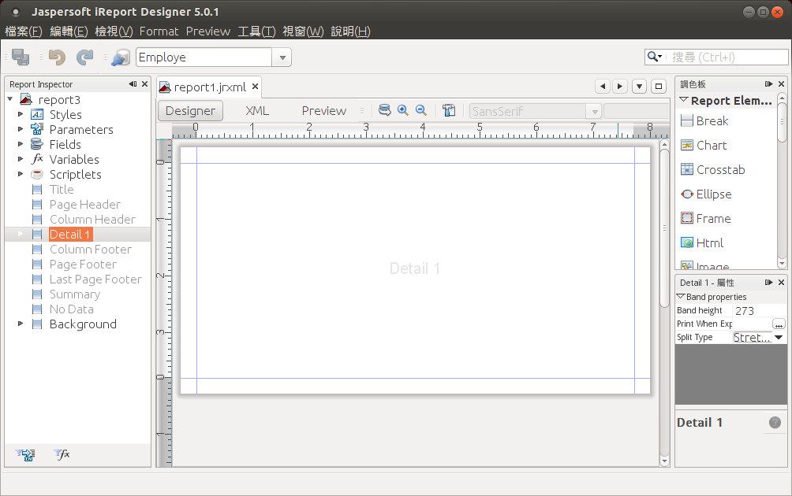

# 使用 iReport 5 免費開源軟體製作精美報表 #

電子報表在辦公室電腦化作業扮演重要的角色，由於需要合併處理數量龐大的資料，需要報表軟體才能省時不費力，例如 Crystal Report 與 Active Report 等都是知名的報表軟體。在全面採用自由軟體的工作環境中，我們使用開放源碼軟體 JasperReport 與 iReport 滿足報表需求。

## Part 3 ##

### 報表使用圖片與條碼 ###

在上一期我們已經分享如何使用 CSV 作為 iReport 報表的資料來源，本期將延續使用員工資料的範例，為讀者說明 iReport 的套印功能，包含在報表中使用圖片檔與一般維條碼。

相信 iReport 簡單易用的操作，您可以很快就成為辦公室裡的報表套印高手喔！

### 建立新報表 ###

關於建立新報表的流程，我們在前期已有詳細說明，所以不再提供詳細的操作畫面。

使用主選單的「檔案 / New」建立新報表，本次使用「Blank A4」這個空白的範本，作為新報表的基礎，在資料來源的地方，仍使用我們在上一期已經建立「Employe」資料來源，這是一個自訂的 CSV 資料來源，從「employe.txt」文字檔取得所需的員工資料。

員工資料（employe.txt）是 CSV 格式的純文字檔案，內容範例如下：

    員工編號,姓名,性別,職稱,分機號碼
    A01,陳小莉,女,經理,5301
    A02,王大明,男,專案經理,5302
    A03,張大仟,男,工程師,5303
    A04,李曉龍,女,工程師,5304
    A05,吳明世,男,行政助理,5305

本次的範例是製作員工識別證，因此我們只需要留下報表中 Detail 這個區塊。首先將其他不必用到的區塊刪除，避免產生的報表有太多空白的地方。新建的報表首先需要刪除「Title、Page Header、Column Header、Column Footer、Page Footer、Summary」等區塊，刪除區塊的方法，是在左側 Report Inspector 中選取區塊名稱（例如 Page Header），再點選滑鼠右鍵選單的「Delete Band」將區塊移除。

移除不必要的區塊後，再用滑鼠將「Detail」區塊的高度增加到適當的大小，這個區塊將用來放置識別證的員工資料。

在 iReport 報表編輯畫面的右方，調色板（Palette）提供報表設計所需的各種元件，我們先用以下兩種元件輸出員工資料。

1. Static Text
2. Text Field

上述兩種元件都是用來顯示文字資料，差別是 Text Field 可以從資料來源動態讀取指定的欄位資料，並可以透過內建的函數進行額外的處理。

首先分別使用三個 Text Field 元件來放置姓名、職稱及分機號碼，將 Text Field 從調色板拖曳到報表適當的位置，並從報表上方的設定選項調整字型大小；將這些 Text Field 的內容，依照資料來源的欄位名稱作修改，例如：

* $F{姓名}
* $F{職稱}
* $F{分機號碼} 

這是 iReport 報表從資料來源讀取指定欄位的語法，格式為：``$F{欄位名稱}``。

使用 Static Text 放置一般文字資料，例如我們需要直接印出「分機號碼」。

將報表內容調整成適當的大小，並拖曳元件到適當位置，第一階段的報表內容就已經完成了。

點選預覽（Preview）按鈕，可以看到

### 使用一維條碼 ###

在報表中使用一維條碼（Barcode），是個相當常見的報表設計方式，透過條碼掃瞄器的協助，可以減少人工輸入資料較費時又容易發生錯誤的麻煩。很幸運的 iReport 內建多種條碼格式，只需要幾個步驟，就能夠在報表中加入條碼。

調色板（Palette）提供「Barcode」元件，用滑鼠點選後拖曳到報表。

新增 Barcode 元件需要選擇條碼格式，iReport 使用兩套不同的 Java 函式庫提供條碼產生功能，分別是 Barbecue 與 Barcode4J，報表設計者可以依照需求選擇合適的條碼格式，在挑選條碼格式時必須考慮：

1. 所使用的條碼掃瞄器是否支援此種格式
2. 原始資料是否為純數字或包含英文字母

此範例使用員工編號產生條碼，因為是以一個大寫英文字母為首，所以選擇 Barcode4j 支援英文字母的「Code39」條碼格式。

新增 Barcode 元件後，先用滑鼠選取元件，再到右側的屬性視窗，修改「Code Expression」屬性內容為「$F{員工編號}」。

將 Barcode 元件拖曳到適當的顯示位置。

使用預覽功能，查看報表中的條碼顯示結果。如果條碼的設定不正確，例如選擇使用不支援英文字母的條碼格式來顯示員工編號，就會顯示錯誤訊息而無法順利預覽。

如此一來，我們製作好的員工識別證，就可以利用條碼掃瞄器讀取員工編號。

## 使用圖片檔 ###

除了顯示文字和條碼，iReport 也提供圖片元件，可以方便地將磁碟上的圖片檔案，加入報表中顯示。

首先我們幫每位員工製作好一張個人的相片，並將圖片檔依照員工編號命名，並存放在指定資料夾中，例如：

* /home/demo/report1/A01.png
* /home/demo/report1/A02.png
* …依此類推

從調色板選取 Image 元件，並拖曳到報表中。

先選取一個圖片檔，才能順利新增 Image 元見到報表。

我們希望每張識別證的圖片檔案名稱，都是藉由資料來源的「員工編號」動態產生，所以需要修改 Image 元件的右方屬性設定，將屬性「Image Expression」內容修改成：

    "/home/demo/report1/"+$F{員工編號}+".png"

屬性名稱包含 Expression 的欄位，在 iReport 可以支援簡易的程式語法，在這個例子中，我們將資料來源讀取到的欄位內容，加上圖片檔案存放的路徑與副檔名（.png）組合成一個完整的圖片絕對路徑。

修改屬性設定後，在報表編輯畫面中無法顯示圖片，這是因為圖片檔案路徑在編輯階段尚未產生。

使用預覽報表功能，可以看到每張員工識別證，分別依照員工編號顯示個人的相片。

### 善用報表工具提昇辦公室效率 ###

iReport 是相當容易學習的報表工具，不但免費而且功能十分強大，只要學會基本的報表製作技巧，即使完全不會寫程式，也能利用簡易的資料檔（例如 CSV 或 Excel 等），製作出美觀實用的報表。

比起一般文書處理的批次套印功能，iReport 是專業級的報表製作工具，可以將大量的資料依照精確的排版格式套印輸出，製作好的報表可以重複利用，不管製作郵寄信封、識別標籤或列印支票，都可以輕鬆上手。