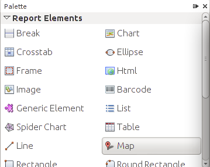
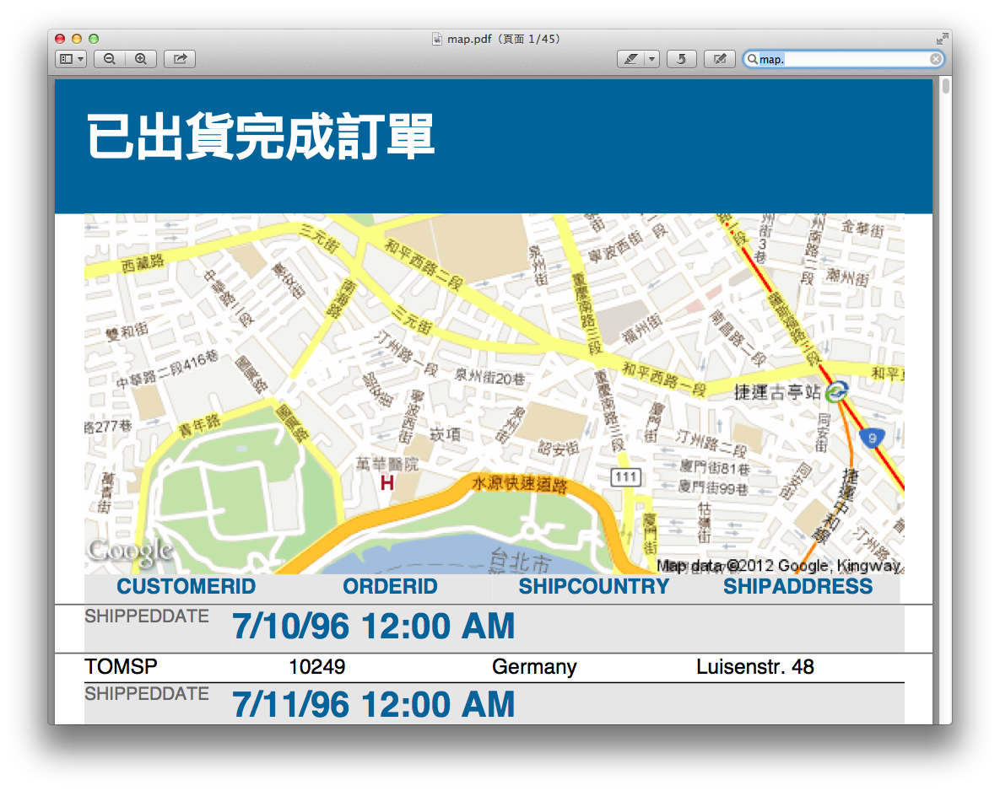
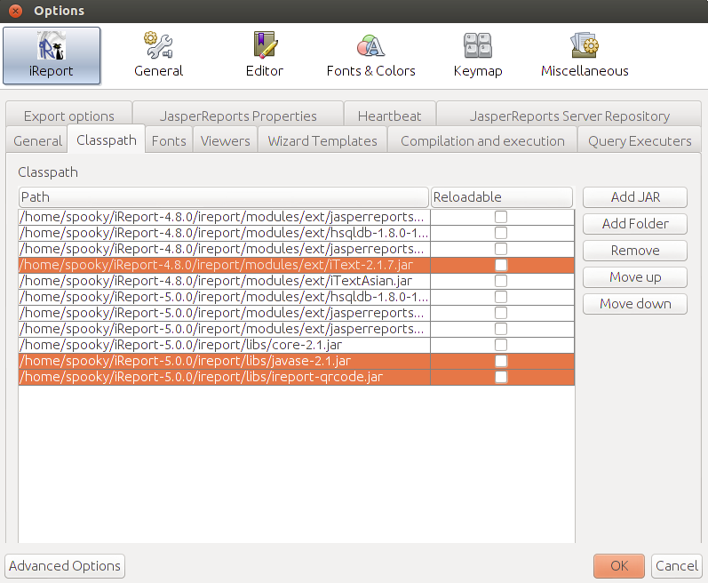
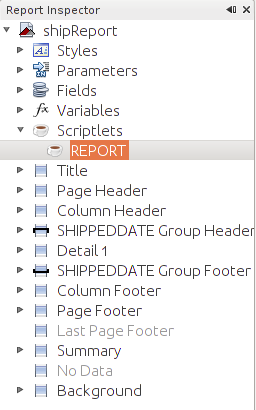
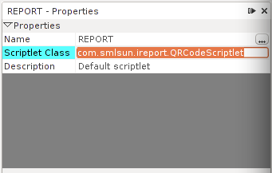
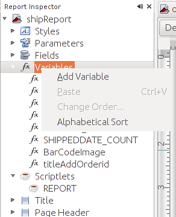
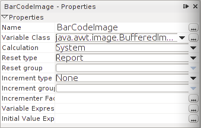
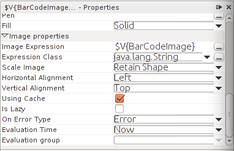
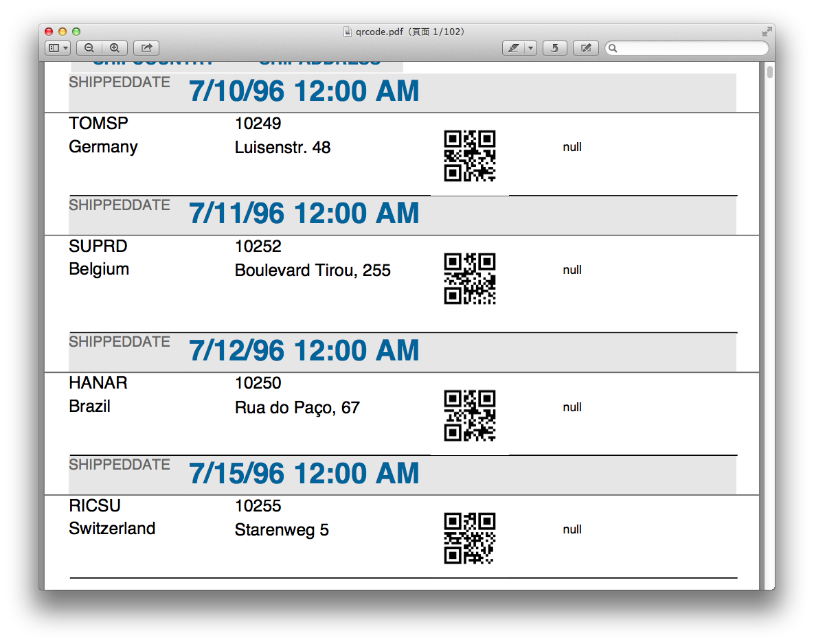

##地圖元件

地圖元件，就在11月底的時候 ireport 釋出 ５.0.0 的新功能，這邊介紹一下如何使用該元件，圖資來源就是google，首先同樣的在左邊palette 的 report Elements可以看到有個Map 元件，如下圖：

把它拖拉到你想要放置地圖的地方，接著你需要知道你要插入地圖的位置的座標，可以利用google map把你想查的點查出來後取得座標，查出來以後我們將座標資訊輸入如下圖：

可以看到他有兩個參數分別是 ``Lat. Expr`` ``Lon. Expr``，也就是經緯座標的輸入，然後我們可以看到下面還有個``Zoom. Expr`` 也就是縮放比例，這個也必須設置，不然地圖細節看不到，也就沒意義了，這邊將其設置為15，最後還有個``Language``的屬性，根據你的地圖所需要顯示語系做設置，這邊設定為 ``"zh-TW"``，OK，如此一來我們就可以看結果了，如下圖： 

當然可以在搭配資料庫動態顯示地圖，比如說如範例報表可以顯示每個出貨地點的地圖，只要在欄位定義多個經緯度，如此就可以根據欄位作為資料來源，顯示每個出貨地點的地理資訊，如此一來，地圖呈現將會更加便利。

##QR CODE 的產生

開始說明如何使用ireport 產生QRCODE 之前，需要先說明，此為進階功能，讀者必須做一點程式開發，並且必須要有JAVA的開發環境，筆者為了簡化開發JAVA所需的引入套件，編譯以及包jar將使用 ``gradle`` 來做為 build script，可以把它想像成ant 的強化版，在這邊就不進一步敘述，重點還是放在產生QRCODE的所需步驟，透過這章節也將可以了解ireport 除了一些方便的報表製作的元件外，透過其內建的Scriptlet 可以方便的引入外部程式進行資料運算與處理，那我們就開始吧！

首先先簡單的說明一下要產生QRCODE的步驟：

1. 因為ireport並沒有內建的QRCODE generater，因次若要產生QRCODE我們需要使用外部套件，協助將資料進行轉換
2. 為了要能夠讓ireport的資料能夠交由別的程式進行處理，我們需要使用到ireport提供的scriptlet作為插件引入，自行定義的程式
3. 最後必須將處理結果，傳回ireport進行顯示，我們將透過ireport的變數物件``Variable``作為處理結果的容器，並且顯示在報表上面，步驟清楚了，再來就開始實作部分，首先必須先把相依套件準備好。

### 所需套件名稱與對應版本

下面是gradle所定義的套件相依性的程式碼：

	apply plugin: 'java'

	repositories {
    	mavenCentral()
	}
	dependencies {
    	compile group: 'com.google.zxing', name: 'javase', version: '2.1'
    	compile group: 'net.sf.jasperreports', name: 'jasperreports', version: '5.0.0'
    	compile group: 'com.lowagie', name:'itext', version:'2.1.7'
	}

其中各個套件使用目的如下：

* jasperreports: ireport的core，凡是需要實作ireport的相關功能都需要使用到此套件，為了產生QRCODE我們需要使用到ireport 的scriptlet，故我們必須 extends JRDefaultScriptlet，後續會在詳細說明
* itext: jasperreports在使用時需要用到itext套件，故必須引入
* zxing: 是google 的開源套件，就是要用來產生QRCODE image的

一旦相依套件準備好了我們就可以開始進行程式的開發。

### 製作Scriptlet產生QRCODE

程式碼如下：

	package com.smlsun.ireport;
	import com.google.zxing.BarcodeFormat;
	import com.google.zxing.WriterException;
	import com.google.zxing.common.BitMatrix;
	import com.google.zxing.qrcode.QRCodeWriter;
	import com.google.zxing.client.j2se.MatrixToImageWriter;
	import net.sf.jasperreports.engine.JRDefaultScriptlet;
	import net.sf.jasperreports.engine.JRScriptletException;

	public class QRCodeScriptlet extends JRDefaultScriptlet {
	    public void afterDetailEval() throws JRScriptletException {
	        QRCodeWriter writer = new QRCodeWriter();
	        BitMatrix matrix = null;

	        try {
	            matrix = writer.encode(getFieldValue("ORDERID").toString(), BarcodeFormat.QR_CODE, 256, 256);
	            this.setVariableValue("BarCodeImage", MatrixToImageWriter.toBufferedImage(matrix) );
	        } catch (WriterException e) {
	            e.printStackTrace();
	        }
	    }
	}
	
上述得程式中我們可以看到class extends JRDefaultScriptlet 並且實作了 ``afterDetailEval()``這個void ，也就是說當Detail band 報表展開完成後，將開觸動此void

接著可以看到在程式中 ``QRCodeWriter writer = new QRCodeWriter();``就是用來產生QRCODE 的物件，接著 ``BitMatrix matrix``將承接 ``QRCodeWriter``產生後的資料，然後在透過 ``MatrixToImageWriter``將 ``BitMatrix``所承接的資料轉換為 Image。

其中資料來源將透過``getFieldValue("ORDERID")`` 取得報表中從Data Source取得的欄位內容進行轉換，並且將轉換好的圖片檔塞入變數``BarCodeImage``，透過 `` this.setVariableValue("BarCodeImage", BufferedImage)``

如此一來最難的JAVA程式就算完成了，接著我們必須將他打包成jar檔，在此筆者的jar檔檔名為``ireprt-qrcode.jar``，引入ireport的classpath，並且別忘了相依的套件也必須一併引入才行，連同``zxing``，``jasperreports``還有``itext``，結果如下圖：

就算完成產生QRCODE的Scriptlet並且載入ireport接著下一步驟。

### ireport 綁定 Scriptlet

首先我們必須將剛剛完成並切引入ireport的jar註冊到scriptlet，我們可以在左邊的 report inspector，看到有個Scriptlets，將其打開並且點選底下的REPORT，如下圖

要定義載入的class，可以看到右邊的REPORT - Properties，下面有個Scriptlet Class，如下圖

鍵入剛剛完成的class package 路徑 ``com.smlsun.ireport.QRCodeScriptlet``，OK～如此一來就算將我們寫的scriptlets註冊到ireport了！

### 建立 BarCodeImage  Viariable 

然後我們必須創建一個變數``Viariables``，作為scriplet處理結果的容器，也因此我們需要建立一個這樣的變數，操作方式如下圖：

在 Viariables 上面用滑鼠右鍵，點選Add Variable，在Viariables下面將多一個 variable1，需要在定義他的 Properties，如下圖：

在剛剛的程式碼中我們將承接變數的名稱命名將Name 改為``BarCodeImage``

還記得剛剛得程式中我們需將scriptlet處理結果置於 BarCodeImage這個variable，因為最後產生的QRCODE是圖片的形式所以需指定型態為``BufferedImage``，所以需將 Variable Class 更改為``java.awt.image.BufferedImage``，需特別提醒，下拉選單是挑不到的，請直接鍵入，並且記得大小寫必須一致。

最後我們必須將``Calculation``設定為 ``System``，也就是告訴ireport此變數執行的運算的是系統定義，其他還有很多不同的運算式像是``Count`` ``Sum`` ``Average``等，在這邊不細談。

### 使用 ireport image Element 顯示QRCODE

就快完成了！剩下最後一哩，我們需要之前有說明過的image Element作為做後呈現的媒介，同樣我們將image拖拉到我們需要呈現QCODE的位置，編輯該元件的Properties，如下圖

在Image Expression裡我們需要填入剛剛建立並且設定好的 ``$V{BarCodeImage}``，前置詞``$V``代表為 Viariable，表示image元件呈現內容的來源為``$V{BarCodeImage}``，而``$V{BarCodeImage}``將會承接 ``QRCodeScriptlet``處理結果，整個運作路徑就清楚了，最後就可以來看運作結果了，如下圖：

QRCODE產生完成！透過實作產生QRCODE將更了解ireport的運作，可以有更多延伸，比如說第三方的圖表呈現，或者引入html 都可以很方便做到，透過Scriptlet也可以簡化報表製作的複雜度，有些運算在ireport內很難設定，但用程式處理也許就有現成的程式碼可以使用，像QRCODE就是一個很好的例子。

